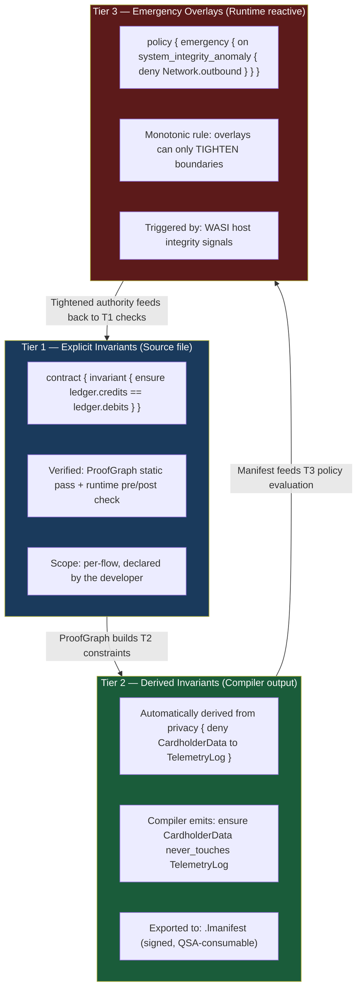
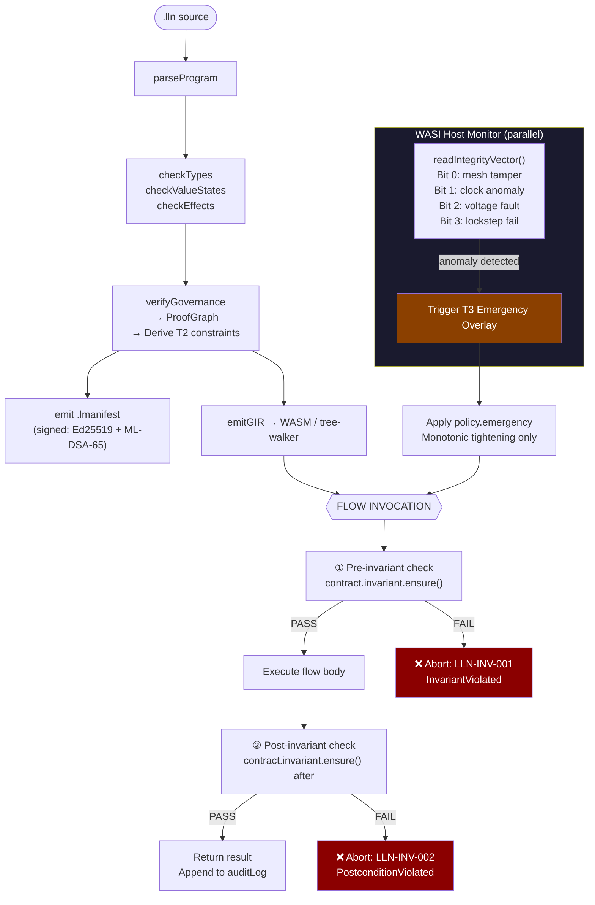
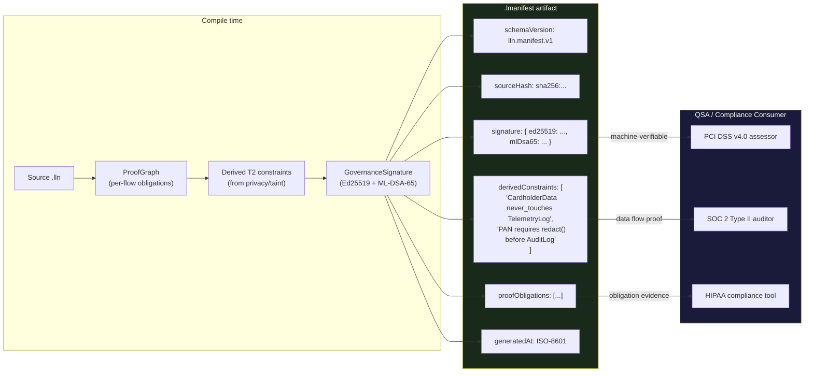
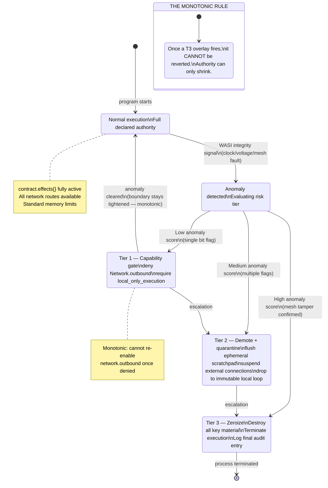
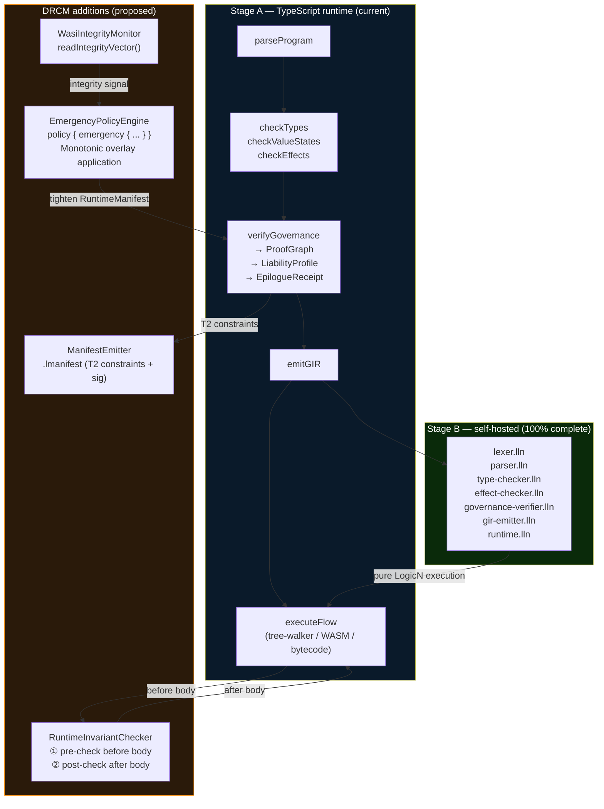
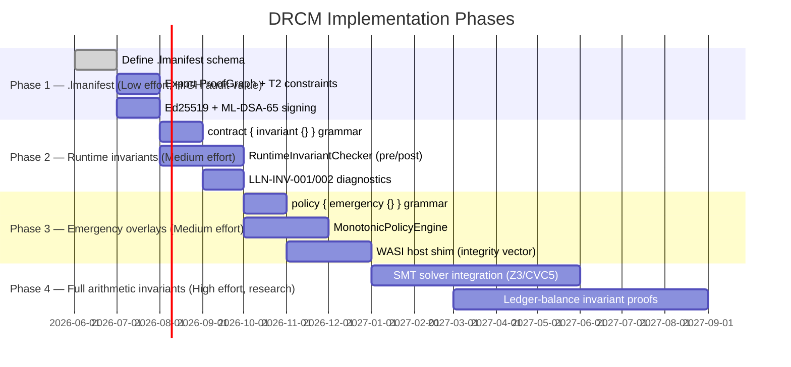

# LogicN — Deterministic Runtime Containment Model (DRCM)

**Author:** Design analysis + architecture mapping (2026-06-03)  
**Status:** Design proposal — three tiers have different implementation readiness.  
**Research:** Deep-research workflow findings folded in where verified.

---

## My honest read of the concept

The revised document (vs the original "digital fortress" version) is substantially better —
but it still conflates three things that should be kept architecturally distinct:

1. **Compile-time invariants** — things the compiler proves before any code runs
2. **Runtime pre/post checks** — expressions evaluated immediately before/after each flow executes
3. **Emergency policy overlays** — reactive boundary tightening triggered by host-level signals

LogicN already covers category 1 almost completely. Category 2 is the genuinely new piece.
Category 3 requires a new `policy {}` contract block and a WASI host shim.

The most powerful single idea in the document is the **Monotonic Security Rule**:
*a runtime policy transition can only shrink the execution authority, never expand it.*
This is formally clean, directly implementable, and has no analogues in existing governed runtimes.

---

## What LogicN already covers

| DRCM concept | Already in LogicN | Gap |
|---|---|---|
| Derive taint constraints from `privacy {}` | ✅ `checkValueStates`, `source_from` annotation | Constraints not yet exported to `.lmanifest` |
| Compile-time proof that secrets don't reach sinks | ✅ LLN-SECRET-001/002/003 | Inter-flow taint (partial) |
| Monotonic deny-by-default for effects | ✅ effects are deny-by-default; omitted = pure | Emergency *overlay* tightening not wired |
| Cryptographic build evidence | ✅ GovernanceSignature (Ed25519 + ML-DSA-65), ProofGraph | Not yet exported as a standalone `.lmanifest` artifact |
| Termination proof | ✅ `decreases` annotation + LLN-TERM-001 | Full pre/post arithmetic invariants not checked |
| Per-flow audit trail | ✅ `RunResult.auditLog`, `AuditLog.write` | Not yet structured for QSA consumption |

---

## The Three-Tier Model — precisely defined

---

## Runtime execution with DRCM

---

## .lmanifest generation pipeline

---

## Emergency overlay activation

---

## How it fits into the current LogicN runtime stack

---

## Implementation phases — what to build and in what order

---

## The novel contribution — precisely stated

Most governed runtimes (OPA, Cedar, WASM Component Model) enforce policy *at call boundaries*.
LogicN's DRCM proposes something different:

> **Policy is a monotonically-shrinking state machine across the lifetime of a session,
> not a per-call decision.**

The difference:
- OPA: "is this *specific request* allowed?" → per-request evaluation
- Cedar: "does this *principal* have *permission* on this *resource*?" → per-authorization
- LogicN DRCM: "what is the *current authority envelope* for this session, given everything that has happened?" → monotonically-evolving state

This is closer to **CHERI capability revocation** (hardware-enforced monotonic capability loss)
or the **Biba integrity model** (no-write-up: data at a lower integrity level cannot contaminate
a higher level) — but applied at the *runtime session layer*, driven by *host telemetry*,
and expressed in the *source language* via `policy { emergency { ... } }`.

To the author's knowledge, no production programming language exposes this as a first-class
language construct. It would be genuinely novel.

---

## What I'd challenge in the original document

1. **"Compilation aborts when invariants are violated"** for `ensure ledger.credits == ledger.debits` —
   this requires a full SMT solver (Z3/CVC5) to check statically. Our `decreases` annotation
   checks *termination* (simpler). Arithmetic equality invariants across execution paths are
   generally undecidable. The honest position: LogicN can check them *at runtime* cheaply
   (just evaluate the expression), but static proof requires Dafny/Lean-level infrastructure.
   Phase 2 (runtime pre/post checks) is implementable now. Static proofs are Phase 4.

2. **`ensure CardholderData never_touches PublicTelemetryLog`** is already enforced — the
   value-state checker's `privacy { deny }` + `source_from` annotation already blocks this at
   compile time. The *novel* part is exporting that proof as a signed `.lmanifest` artifact
   that an auditor can machine-verify without reading source code.

3. **The WASI integrity vector** (readIntegrityVector() returning a 4-bit hardware status) does
   not currently exist in WASI Preview 2. It's a proposed extension. For a software-only
   implementation, the `policy.emergency` block can be triggered by *software* signals:
   abnormal memory growth, unexpected exception patterns, failed invariant checks.
   Hardware signals (mesh tamper, voltage fault) require the ASIC tier — which is correctly
   placed in the Future Research Appendix.

---

## Sources (from deep-research — to be filled in when workflow completes)

*This section will be updated with verified citations from the deep-research workflow.*
