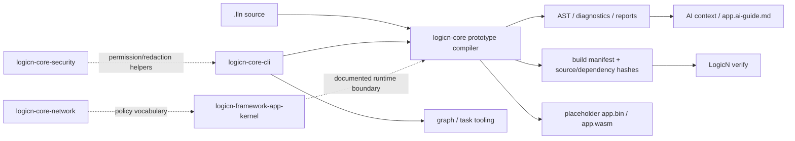
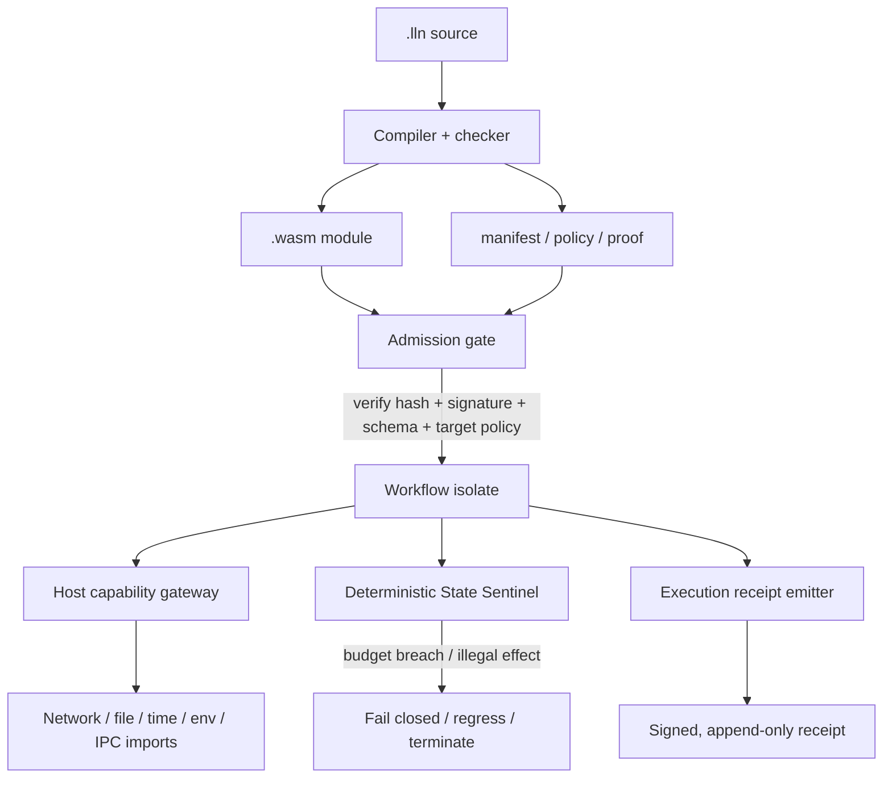
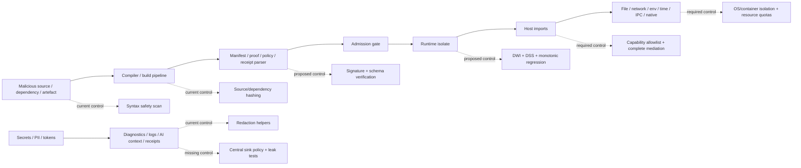

# LogicN security assessment of the runtime, sandbox, and new containment documentation

## Executive summary

LogicN currently presents two distinct realities. The first is an ambitious monorepo design for a security-first language, runtime, network policy layer, secure app kernel, task system, and target backends. The second is a much smaller implemented prototype. The repository itself says `logicn-core` is a v0.1 beta language-design and prototype project, with the runnable prototype living in `packages-logicn/logicn-core/compiler/logicn.js`; it can check and run a documented subset of `.lln` files, generate reports, and emit placeholder build artefacts, while CPU-compatible checked execution and WebAssembly target planning are the practical v1 baseline. The separate `logicn-core-compiler` package is explicitly described as a future compiler package and currently contains only a conservative syntax safety scan for a narrow core subset. `logicn-core-runtime` currently exposes runtime contracts rather than a demonstrably hardened execution engine, while `logicn-core-security` is one of the few packages with substantive reusable logic today. citeturn19view0turn33view3turn45view0turn12view2turn11view0

The new seven-module documentation introduces a far stronger security architecture than the currently implemented codebase: a Deterministic Runtime Containment Model, formal invariant contracts, an emergency policy mechanism, monotonic state regression, a Deterministic Workflow Isolate, a Deterministic State Sentinel, and an append-only execution receipt model. As design direction, this is strong: it pushes LogicN toward signed artefacts, explicit admission control, capability-gated host interaction, isolate-per-workflow execution, runtime tripwires, and auditable receipts. Those are exactly the right concerns for a language that wants to make serious sandbox and runtime claims. fileciteturn0file0 fileciteturn0file1 fileciteturn0file2 fileciteturn0file3 fileciteturn0file4 fileciteturn0file5 fileciteturn0file6

My opinionated assessment is that LogicN’s **security philosophy is ahead of its implementation maturity**. The repository already shows the right instincts — fail-safe defaults, deny-by-default permissions, typed boundaries, secret-redaction primitives, explicit routing/kernel boundaries, and an unwillingness to pretend placeholder artefacts are runnable binaries. But if LogicN is ever going to execute attacker-controlled code, the decisive security boundary will not be the language surface alone; it will be the **embedder/host boundary**, because WebAssembly itself provides no ambient access and leaves environment interaction to imported host capabilities, and the embedder is responsible for deciding what those capabilities are and how they are constrained. Wasmtime’s own security guidance says WebAssembly is sandboxed by design, but also documents the need for defence in depth, capability-based WASI filesystem access, terminal-output filtering, resource limiting, and ongoing Spectre mitigations. In other words: the proposed LogicN model is directionally correct, but the project does **not yet have enough visible host-runtime enforcement to justify “hardened sandbox” claims**. citeturn51view3turn49view0turn50view1turn50view2turn50view3turn50view4turn50view6turn50view7turn50view8

The highest-priority work is therefore not to add more language surface area. It is to make the containment model mechanically real: explicit trust boundaries, import allowlists, canonicalised capability descriptors, hard memory/time/instance limits, signed and schema-validated manifests, release provenance, redaction-at-sink, and a host-runtime implementation that can be independently tested and attacked. Until then, LogicN is best described as a promising secure-language/runtime design with several useful security primitives, not yet as a production-grade language runtime or sandbox. citeturn33view0turn33view3turn42view3turn52view0turn61view0

## Scope and assessed artefacts

This assessment is grounded in the repository root and package documentation, visible source surfaces for the implemented packages, and the seven newly supplied markdown modules. In the repo, the most security-relevant inspected materials were the root project map and layering rules, `logicn-core` documentation, the `logicn-core-compiler` README and source safety scanner, the `logicn-core-runtime` interface surface, the `logicn-core-security` source, the `logicn-core-network` README, the `logicn-framework-app-kernel` README, and the `logicn-core-cli` entrypoint and package metadata. The new documentation was reviewed as supplementary design material associated with the project. No in-repo paths were specified for those seven uploaded markdown files, so I treat them as authoritative new design documents for this review, but not as repository paths that I could verify in the Git tree. citeturn1view0turn19view0turn45view0turn12view2turn11view0turn35view0turn36view0turn12view0turn34view4 fileciteturn0file0 fileciteturn0file1 fileciteturn0file2 fileciteturn0file3 fileciteturn0file4 fileciteturn0file5 fileciteturn0file6

The table below summarises the current maturity of the most relevant components based on the repository’s package map, package READMEs, and visible source surfaces. It is important because the security posture of LogicN depends less on the breadth of the package map and more on which packages are already doing real enforcement today. citeturn42view2turn44view2turn45view0turn11view0turn36view0

| Component | Observed current state | Security relevance | Assessment |
|---|---|---|---|
| `logicn-core` | Actual runnable prototype CLI/compiler; parses/checks subset, runs simple `.lln`, generates reports and placeholder artefacts | Central build/execution entry for current prototype | Real implementation, but explicitly non-production |
| `logicn-core-compiler` | Future compiler package; current implementation is a conservative syntax safety scan | Compile-time prevention of dangerous patterns | Useful, but shallow and regex-like rather than full semantic enforcement |
| `logicn-core-runtime` | Runtime contracts/interfaces | Would be core runtime boundary if fully implemented | Not enough visible enforcement to treat as hardened runtime |
| `logicn-core-security` | Real helper library with redaction, permission, and crypto-policy checks | Best current reusable security primitive package | Strongest implemented security foundation in the repo |
| `logicn-core-network` | Policy and report contracts documented | Network boundary and capability vocabulary | Good design surface, but not a transport or syscall sandbox |
| `logicn-framework-app-kernel` | Optional runtime-policy kernel documented; checked fixtures through core Run Mode | Runtime request security, limits, auth, crash containment | Directionally strong, but enforcement evidence is mostly documentary |
| `logicn-core-cli` | Real CLI entrypoint and build/test graph/task coordination | Operational entrypoint; output handling and task invocation matter | Real, but should be treated as orchestration, not a sandbox |
| New seven-module docs | Containment, invariant, emergency, monotonic regression, isolate, sentinel, receipt design | Proposed high-assurance runtime model | Strong target-state architecture, significantly ahead of implementation |

One useful positive signal is that the project repeatedly avoids overstating what is implemented. The prototype compiler documentation says the generated `app.bin` and `app.wasm` are placeholders and that `LogicN verify` checks metadata so placeholder artefacts cannot be mistaken for runnable binaries. That is a notably good secure-default and anti-confusion decision. Likewise, the root README says production claims should only be made when backed by implementation and tests. citeturn20view0turn42view3

## Architecture and execution model

The repository’s own layering is coherent. At the top level, `logicn-core` owns the language, grammar, type system, effects, memory-safety concepts, reports, and the prototype compiler; `logicn-core-compiler`, `logicn-core-runtime`, `logicn-core-network`, `logicn-core-security`, and related packages are meant to own implementation-oriented compiler/runtime/network/security/config/report contracts; specialised target packages own target-specific output; `logicn-framework-app-kernel` is the optional runtime boundary for APIs and policy; `logicn-framework-api-server` is meant to be the HTTP transport that delegates into the kernel; and CLI/tasks/graph packages are tooling around that core. The project explicitly says `logicn-core` must not become a general web framework and that CPU and WASM are the only active v1 targets. citeturn42view2turn33view3

In today’s repository, though, the execution model is split. The **current executable path** is the prototype in `logicn-core/compiler/logicn.js`, which the package README says can discover `.lln` files, lex them, parse core declarations into AST JSON, extract strict comments, type-check declared types and some matches, run simple checked `main` scripts, generate schemas and OpenAPI drafts, generate reports, and regenerate `app.ai-guide.md`. It also records deterministic inputs using SHA-256 for source files and declared dependencies, and it emits a build manifest that distinguishes reproducibility inputs from metadata. Meanwhile, `logicn-core-compiler` separately documents only an early syntax scan, and `logicn-core-runtime` separately documents only future runtime contracts. citeturn20view0turn45view0turn12view2turn54view1

That means the current practical flow looks roughly like this:



That diagram is supported by the package map, compiler README, CLI README, security package, and app-kernel/network package documentation. citeturn20view0turn9view3turn12view0turn35view0turn36view0turn11view0

The new documentation proposes a more ambitious future flow. It describes a compile step that emits a WebAssembly module plus manifest, policy, proof, and receipt-related artefacts; an admission gate that validates a cryptographic hash and signature before loading; a Deterministic Workflow Isolate that executes a workflow in a sealed container with immutable imports; a Deterministic State Sentinel that watches runtime budgets and authorised behaviour; an emergency policy path for controlled fail-closed intervention; monotonic regression to a safer previous state; and an Epilogue Receipt that records what happened in an append-only signed form. That is a materially more serious runtime architecture than the currently visible repo runtime surface. fileciteturn0file0 fileciteturn0file1 fileciteturn0file2 fileciteturn0file3 fileciteturn0file4 fileciteturn0file5 fileciteturn0file6

A near-term target-state interaction model would therefore look like this:



This design is conceptually compatible with WebAssembly’s import-based sandbox model, where modules have no ambient access and the embedder chooses which functions and resources to expose. It is also conceptually compatible with capability-based WASI-style resource passing. The gap is that the repository does not yet show the concrete mechanics that make this model true in a hostile environment. citeturn51view3turn50view1turn49view0

## Security assessment

There is already real value in the current code and docs. The compiler safety scan rejects several high-risk patterns while the full compiler pipeline is still being built: direct use of `Tri` in `if` conditions, unsafe conversions between `Tri`, `Bool`, and `Decision`, non-exhaustive `Tri` matches, `unknown_as: true` inside `secure flow`, raw secret-like literals, and unsafe dynamic execution tokens such as `eval`, `Function`, `unsafe_exec`, and `raw_shell`. The security package is also sensibly fail-closed: it fully redacts over-large inputs, validates regex redaction rules, rejects replacement patterns that can re-emit contextual data, denies permission models by default, diagnoses wildcard allows, and rejects weak cryptographic algorithms in permitted lists. At the design level, the network and app-kernel packages both insist on deny-by-default network and effect models, TLS policy, secret-safe logging rules, rate limits, crash containment, CSRF and idempotency controls, workload limits, and structured cancellation semantics. citeturn45view0turn10view1turn11view0turn35view0turn35view3turn36view0

The central problem is that **the implemented trust boundary is still too soft**. The WebAssembly specification makes two things very clear: WebAssembly provides no ambient access to the host environment, and any interaction with I/O, resources, or OS calls happens only through imported functions provided by the embedder; it also explicitly places side-channel mitigation responsibility on the embedder. Wasmtime’s security documentation makes the same point in practical terms and adds defence in depth, capability-based filesystem access, terminal filtering, and Spectre mitigations. LogicN’s new documents clearly understand the need for an admission gate and host-capability gating, but the repository’s visible runtime package is still only a contract surface. That means the decisive “sandbox or not?” question is unresolved in code. citeturn51view3turn49view0turn50view1turn50view2turn50view3turn12view2

A second concern is **capability precision**. The current `logicn-core-security` permission model is useful, but it is still a generic string-based grant system with exact or wildcard resource matching. That is enough for reports and early policy modelling, but it is not strong enough on its own for real filesystem, network, IPC, or native-library mediation, because real host resources need canonical representation, path normalisation, symlink handling, port/protocol typing, and revocation semantics. Saltzer and Schroeder’s complete-mediation principle is especially relevant here: every access to every object must be checked, and cached results should be examined sceptically when authority can change. The new docs’ capability-bitmask and isolate model are directionally better than the current string grants, but the current security helper code is not yet a sufficient reference monitor. citeturn11view0turn61view0

Resource exhaustion is the third major gap. The new docs do the right thing conceptually by introducing the Deterministic State Sentinel and workflow-local isolation, but there is no visible runtime implementation yet that proves enforcement of CPU, wall-time, memory, instance-count, table-count, or host-call budgets. Wasmtime provides practical controls for this exact problem — deterministic fuel accounting, epoch-based interruption, and store limits over instance counts, linear memories, and memory size — but nothing in the inspected LogicN runtime surfaces shows those controls already wired into the runtime or admission path. For a language runtime that may execute hostile or merely buggy programs, this is not optional defence in depth; it is baseline containment. fileciteturn0file4 fileciteturn0file5 citeturn50view4turn50view5turn50view6turn50view7turn50view8

Another important issue is that **WebAssembly does not magically grant memory safety for unsafe source languages or unsafe host boundaries**. The WebAssembly spec says Wasm is memory-safe in its own execution model, but also explicitly states that it cannot guarantee an unsafe language compiling to Wasm does not corrupt its own memory layout in linear memory. Academic work reinforces this. Research on WebAssembly security has shown that compiling unsafe programs to Wasm can preserve or even alter exploitability, and that source-level protections such as stack canaries are not always preserved by default in the same way developers expect. Research on MSWasm exists precisely because ordinary Wasm is not sufficient to make unsafe programs memory-safe by construction. So if LogicN intends to use Wasm as a backend, the strongest claim it can make is “good sandbox substrate with explicit host capability control,” not “Wasm backend automatically solves memory safety.” citeturn51view2turn48academia1turn48academia3

Unsafe deserialisation is not a visible bug today, but it is a **future high-risk seam** because the new docs introduce multiple machine-readable artefacts — manifests, policies, proofs, and receipts — and the repo already relies heavily on report generation and AI-readable context. OWASP’s guidance is straightforward: risk is substantially reduced by avoiding native serialisation formats, and if deserialisation is unavoidable, only signed data should be deserialised. LogicN’s design is already leaning toward signed artefacts, which is good, but the exact serialisation format, canonicalisation rules, schema versioning, and verification order need to be nailed down before these structures become a trusted runtime substrate. fileciteturn0file0 fileciteturn0file6 citeturn53view0turn53view1turn54view0turn54view1

Logging, reporting, and AI-context generation are a quieter but very real threat surface. The repo explicitly generates AI-readable context, route/security/build reports, and `app.ai-guide.md`, while the app-kernel docs call for secret reports, crash reports, API/auth reports, and other runtime outputs. OWASP’s logging guidance says tokens, passwords, encryption keys, access tokens, database connection strings, high-classification data, and some internal addresses should not be logged directly, and that event data must be sanitised to prevent log injection. LogicN’s redaction helpers are a solid start — they specifically target bearer tokens, api-key assignments, and private-key blocks — but the current evidence is strongest for redaction primitives, not for a proven end-to-end sink policy across compiler diagnostics, CLI output, AI context, receipts, crash reports, and developer tooling. This is especially important because the project’s AI-readable context is explicitly a first-class output. citeturn20view0turn36view0turn11view0turn53view2turn53view4turn53view5

Supply-chain posture is mixed. The prototype compiler already records deterministic inputs, source/dependency hashes, and a build-input hash in the manifest, which is better than many early-stage projects. But SLSA distinguishes between local provenance, signed provenance on dedicated infrastructure, and hardened builds that prevent one run from influencing another and keep signing material inaccessible to user-defined build steps. LogicN’s current documented hashing is a useful internal reproducibility aid; it is not yet the same thing as consumer-verifiable release provenance. The new docs’ admission-gate/signature direction is good, and the use of ML-DSA concepts is aligned with current NIST standardisation, but these controls need to be connected to actual release engineering, key custody, rotation, and verification. citeturn20view0turn52view0turn54view0turn54view1

The threat model below captures the most important attack paths and where present or proposed controls apply.



This prioritisation is based on the current implementation state, the project’s own package boundaries, and official WebAssembly/WASI/Wasmtime guidance. citeturn45view0turn20view0turn11view0turn36view0turn49view0turn50view1turn50view7turn51view3

| Risk area | Why it matters now | Current posture | Priority |
|---|---|---|---|
| Host import and syscall mediation | This is the real sandbox boundary | Proposed in docs; not visibly hardened in runtime code | Critical |
| CPU/memory exhaustion | Infinite loops and memory growth are standard sandbox failures | Conceptual only; no visible enforced limits in runtime package | Critical |
| Secret leakage via reports, AI context, logs, receipts | LogicN intentionally emits many machine-readable outputs | Good primitives, incomplete end-to-end sink enforcement evidence | High |
| Capability confusion and privilege escalation | String grants are insufficient for real OS resources | Early deny-by-default model exists, but not structured mediation | High |
| Supply-chain tampering | Signed manifests/receipts are central to the new model | Internal hashes exist, external provenance story incomplete | High |
| Unsafe/native interop | Any native escape can collapse the sandbox | Restricted in docs, but boundary not yet visibly implemented | High |
| Unsafe deserialisation of manifests/proofs/receipts | Signed runtime artefacts become trust anchors | Future risk unless canonical and strictly validated | Medium |
| Side channels and VM/JIT vulnerabilities | Wasm isolation is not a full microarchitectural defence | Recognised by upstream runtimes; LogicN docs under-specify mitigations | Medium |

## Comparison with best practice and standards

Against classic secure-design principles, LogicN is strongest on **fail-safe defaults**, **open design**, and **least privilege as an architectural aspiration**. The repo repeatedly says deny-by-default permissions, network default deny, CPU baseline fallback, minimal v1 surface, and explicit policy/reporting should be the main security story. The security package defaults permissions to deny, flags wildcard allows, and takes fail-closed approaches to redaction failures; the network docs show a concrete `network { default: deny }` model; and the app-kernel docs explicitly deny-by-default effects for file, network, database, shell, AI, GPU, and interop unless policy allows them. Those decisions are very much in the spirit of Saltzer and Schroeder’s fail-safe defaults and least privilege. Where LogicN is weaker today is **complete mediation**: there is not yet enough visible host-level enforcement to show that every sensitive access path really is checked at the final boundary, and the current generic string-grant model is not yet a sufficient authority system for real runtime resources. citeturn61view0turn11view0turn35view3turn36view0turn42view3

Against current WebAssembly and WASI practice, the alignment is good in principle and incomplete in implementation. The WebAssembly spec says Wasm is safe and sandboxed, has no ambient access to the computing environment, and relies on imported host functions for outside-world interaction, with environment-specific security left to the embedder. Wasmtime extends that with practical defence in depth, capability-based filesystem access through WASI, filtered terminal output, and resource-limiting APIs. LogicN’s DRCM, DWI, DSS, capability bitmasking, signed admission gate, and receipt concepts fit that model very naturally. But the repo does not yet show the concrete engine configuration, import allowlists, pre-opened resource mapping, or hard budget enforcement that would make those concepts operational. In short: **the design is consistent with best practice; the implementation evidence is not there yet**. citeturn51view3turn49view0turn50view1turn50view2turn50view4turn50view7turn50view8

Against modern supply-chain expectations, the project is partway there. The compiler prototype already includes deterministic manifests and hash recording, which is valuable. The new docs go further by proposing signature-checked admission and formally meaningful receipts. But SLSA’s stronger levels require more than good metadata: they require provenance, authenticated provenance, dedicated build infrastructure, and hardened build isolation that prevents build steps from influencing one another or accessing signing secrets. For a runtime that wants to trust manifests or proofs at load time, those release-pipeline guarantees matter. The cryptographic choices in the new docs are directionally sensible: NIST’s FIPS 204 now standardises ML-DSA, and FIPS 180-4 remains the Secure Hash Standard baseline for digests. The missing step is not cryptographic imagination; it is operationalising provenance and verification end to end. citeturn20view0turn52view0turn54view0turn54view1

The comparison below summarises where LogicN sits relative to the most relevant external standards and practices. The judgements are based on the cited repo materials, the new design docs, and official Wasm/WASI/Wasmtime and supply-chain guidance. citeturn61view0turn49view0turn51view3turn52view0

| Area | LogicN today | Best-practice target | Verdict |
|---|---|---|---|
| Default security posture | Strong deny-by-default philosophy | Fail-safe defaults, least privilege | Good direction |
| Runtime mediation | Documentary and partial | Complete mediation at final host boundary | Not yet sufficient |
| Wasm sandbox story | Planned, not visibly hardened | Import allowlists, pre-opened resources, hard limits, side-channel posture | Incomplete |
| Release provenance | Internal deterministic hashes | Signed provenance and hardened builds | Incomplete |
| Secret handling | Strong helper library | End-to-end sink policies and leak tests | Partially aligned |
| Logging and receipts | Rich report mindset | Tamper-evident, sanitised, minimally sensitive logs | Promising but under-specified |
| Emergency override design | Explicit and auditable in docs | Separation of privilege, expiry, dual control | Good idea; needs rigid governance |

## Prioritised recommendations

The best next move is to **freeze the v1 trust model** before adding more language or framework surface. The current repo already says v1 should stay intentionally small and that more active surfaces should wait until syntax, memory model, and parser/runtime contracts are concrete enough to test. I agree strongly. Define, in writing and in code, the exact trusted computing base for v1: compiler, manifest signer, admission gate, host runtime, kernel policy engine, receipt signer, and build infrastructure. Everything else — especially loaded modules, third-party tasks, plugins, or generated artefacts — should be treated as untrusted until proven otherwise. citeturn33view0turn33view3turn61view0

The most important implementation recommendation is to build the first real runtime around **explicit capability mediation and hard budgets**, not around language promises alone. If LogicN adopts a Wasmtime/WASI-style host, it should expose no ambient imports, pass only explicit host functions, use pre-opened filesystem directories instead of raw paths, enforce memory/instance/table limits, and apply either fuel or epoch interruption to every untrusted execution context. Beyond the Wasm engine, run the host inside an outer OS sandbox as well — namespaces/jails/containers, seccomp or equivalent syscall filtering, cgroups/job objects for CPU and memory, and a no-new-privileges posture. Wasm should be one containment layer, not the only containment layer. citeturn51view3turn49view0turn50view1turn50view4turn50view6turn50view7turn50view8

A closely related recommendation is to replace the current generic string-resource permission model with **structured capability descriptors**. The existing `definePermissionModel`, `decidePermission`, and `validatePermissionModel` helpers are a good starting point, but real authorisation decisions should operate on canonical resource types such as `fs.read`, `fs.write`, `net.connect`, `clock.read`, `env.read`, `ipc.send`, `ffi.call`, and `receipt.append`, each with typed fields. Filesystem permissions should authorise only canonicalised, resolved paths under a pre-approved root. Network permissions should include protocol, host, port, and TLS posture, not just an opaque string resource. That change would make the docs’ capability-bitmask story much more real and would push LogicN toward complete mediation instead of report-only policy. citeturn11view0turn35view3turn61view0

A concrete shape for that change could look like this:

```ts
type Capability =
  | { kind: "fs"; op: "read" | "write"; root: string }
  | { kind: "net"; op: "connect"; host: string; port: number; tls: true }
  | { kind: "env"; op: "read"; name: string }
  | { kind: "clock"; op: "read"; source: "monotonic" | "wall" }
  | { kind: "ffi"; op: "call"; symbol: string }
  | { kind: "receipt"; op: "append"; stream: string };

function authorise(cap: Capability, request: Capability): boolean {
  // Exact type match, canonicalised resource comparison, no ambient fallbacks.
  // Filesystem checks must happen after realpath/symlink resolution.
  // Network checks must match protocol/host/port/TLS exactly.
  return false;
}
```

The documentation-rich artefact model should also be narrowed into a **strict serialisation and verification policy**. Manifests, policies, proofs, and receipts should use canonical JSON or CBOR, versioned schemas, explicit algorithm identifiers, detached signatures or envelope signatures, and a verification order that never interprets unauthenticated data as trusted configuration. OWASP’s guidance is clear that risk drops sharply when native object deserialisation is avoided and only signed data is deserialised. For LogicN specifically, the admission gate should validate artefact schema, version, signature, hash, target compatibility, feature flags, and policy hash linkage before any execution object is instantiated. citeturn53view0turn53view1turn54view0turn54view1

Treat **AI-readable context, diagnostics, and receipts as secret sinks**. This deserves first-class engineering, not just generic redaction. The repo already produces AI context and multiple report types, and the security package already models secret references and redaction rules. The next step should be a central “safe sink” layer that all diagnostics, logs, receipts, AI context generators, and crash reporters must go through. That layer should refuse raw secret values, typed auth headers, cookies, access tokens, database URLs, encryption keys, and high-classification fields unless an explicitly approved sink consumes them. The project’s own app-kernel and network docs already point toward this; the implementation needs to catch up. citeturn20view0turn11view0turn35view3turn36view0turn53view2turn53view5

On the release side, raise the project from “good internal hashes” to **verifiable supply-chain provenance**. Publish SBOMs, emit signed provenance from dedicated build infrastructure, keep build signing secrets inaccessible to user-defined build steps, and document consumer verification. SLSA Build L2/L3 is the right conceptual benchmark here. The new docs’ admission and receipt ideas become much more meaningful once the build pipeline itself produces attestable trust material. citeturn52view0turn20view0

Finally, keep the emergency path narrow. The emergency policy and monotonic regression modules are good ideas because they recognise that real systems fail and that failure handling is itself part of the security design. But those paths should require separation of privilege, short expiry, signed change records, reason codes, and explicit restrictions that an emergency override may only reduce availability or functionality — never silently broaden authority. That turns the design into a practical embodiment of fail-safe defaults and separation of privilege rather than a hidden “god mode.” fileciteturn0file2 fileciteturn0file3 citeturn61view0

## Suggested tests, benchmarks, and limitations

LogicN needs a test programme that attacks the proposed containment model from the outside, not just one that exercises happy-path language semantics. The compiler package already documents a conservative safety scan, the kernel package already talks about checked fixtures, and the root README documents task dry-run planning and graph generation. The next wave of tests should therefore focus on **containment failures**: import misuse, path confusion, network escape, secret exfiltration, budget overruns, deserialisation tampering, and log/terminal injection. citeturn45view0turn36view0turn44view0turn44view2

| Test area | What to test | Minimum pass criterion |
|---|---|---|
| Admission integrity | Tamper with module bytes, manifest hash, signature, policy linkage, schema version | Admission gate rejects before instantiation |
| Capability mediation | Path traversal, symlink swap, Unicode-confusable paths, wildcard confusion, port mismatches | No unauthorised host operation succeeds |
| Resource exhaustion | Infinite loop, runaway recursion, repeated `memory.grow`, many instances, large tables | Deterministic termination or trap within configured budget |
| Secret-flow control | Secrets in route params, headers, env vars, errors, crash reports, AI context, receipts | Raw secrets never appear in any output sink |
| Log and terminal safety | ANSI escape injection, CR/LF log injection, misleading structured output | Terminal/log output is sanitised or inert |
| Network governance | Plaintext fallback, certificate validation disablement, wildcard outbound access, unsafe raw-socket import | Denied by default unless explicitly declared and policy-valid |
| Determinism | Same source and inputs across repeated runs and different hosts/architectures | Deterministic receipts where promised, bounded nondeterminism where not |
| Supply-chain tamper evidence | Rebuild from same inputs, verify provenance, compare receipts, simulate compromised local build | Consumer can distinguish trusted release from local or forged artefact |

Benchmarks should mirror the containment goals, not just compiler throughput. The most valuable early benchmarks are startup latency per isolate, admission verification latency, host-call overhead per capability type, fuel/epoch overhead, memory footprint per workflow isolate, receipt-emission overhead, and backpressure behaviour under large request bodies or stream floods. The project already documents benchmark tooling as development diagnostics that must not auto-run in production; that is a good default and should remain so. citeturn9view3turn42view2

The main limitations of this review are straightforward. Some repository file blobs could not be fetched line-by-line through the available browsing interface, so this report is strongest where the repo exposed package maps, READMEs, and source surfaces that were directly inspectable. I could not verify the concrete contents of every target package or runtime implementation file, especially where GitHub fetches for deeper blobs failed. The seven new markdown modules were reviewed as uploaded design documents, but no repository paths were specified for them. Most importantly, I found **no high-confidence evidence of a fully implemented hardened LogicN runtime sandbox yet**, so this report intentionally judges the current project as a promising design and partial implementation, not as a finished confinement platform. citeturn19view0turn45view0turn12view2turn36view0 fileciteturn0file0 fileciteturn0file1 fileciteturn0file2 fileciteturn0file3 fileciteturn0file4 fileciteturn0file5 fileciteturn0file6