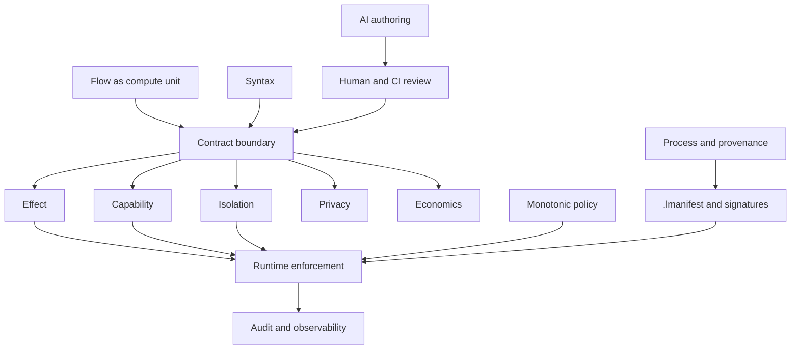
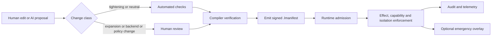

# Mapping LogicN Categories to Design and Runtime Concerns

## Executive Summary

LogicN should treat the `flow` as the chainable unit of compute and the `contract` as the governance boundary around that unit. The strongest current internal design direction already points that way: the runtime-containment note separates compile-time invariants, runtime pre/post checks, signed manifest generation, and a proposed monotonic emergency-policy layer; the secrets note places provider and rotation metadata under `contract { secrets {} }`; and the Zig-ready note makes backend choice, allocator discipline and unsafe-code exclusions part of the governance story rather than mere implementation detail. fileciteturn0file0 fileciteturn0file1 fileciteturn0file2

For Stage B, the practical move is to stabilise a small contract core first, enforce `effects`, `capability`, `privacy`, `limits` and `targets` in both compiler and runtime, emit signed release evidence, and defer experimental monotonic overlays and native/Zig execution until the governed-flow path is proven. Wasmtime and the WebAssembly Component Model are the best immediate runtime anchors because they already emphasise sandboxing, explicit imports, memory isolation, capability-scoped access, and deterministic interruption options. citeturn13view0turn9view0turn20view0turn21view0

The eight user categories are a good start, but they are not sufficient on their own. The most important missing top-level categories are Privacy, Security, Economics, Resilience, Observability, Testing/Verification, Tooling/Change Management, Backends/Interop, and Provenance/Attestation. These should not all become contract blocks, but they should all become explicit design categories, because policy engines, information-flow systems and supply-chain attestation frameworks handle them at different layers. citeturn6view0turn7view9turn17view0turn16view3turn16view2

## Working Model of LogicN

A useful way to frame LogicN is: syntax defines a `flow`; the contract gives that flow a governable boundary; the compiler proves what it can before execution; the runtime enforces what remains through imports, capabilities, limits and isolation; and the delivery process signs and records what was built. That is close to the current internal DRCM direction, and it also aligns with how Wasm components compose through typed imports and exports rather than shared writable memory. fileciteturn0file0 citeturn9view0

Compared with external policy engines, LogicN should keep more meaning inside the language. Cedar and OPA both separate authorisation logic from application code and evaluate requests against policies and structured input at decision time. That is useful for coarse admission control, but it is not enough for LogicN’s intended model of compile-time proofs, signed manifests, and runtime capability envelopes. citeturn6view0turn7view9turn19view0



A coherent Stage B contract surface therefore looks like this. This is a recommended synthesis rather than a published formal language reference; `invariant {}` and `policy { emergency {} }` come directly from the internal runtime-containment note, while `secrets {}` is evidenced in the secrets design note. fileciteturn0file0 fileciteturn0file2

```logicn
secure flow example(...) -> ResultType {
  contract {
    types {}
    intent {}
    request {}
    response {}

    effects {}
    authority {}
    privacy {}
    secrets {}
    audit {}

    limits {}
    economics {}
    targets {}

    invariant {}   // proposed / experimental
  }

  policy {
    emergency {}   // proposed / experimental
  }

  ...
}
```

Not every flow needs every block. Boundary-facing flows should usually declare `request` and `response`; pure internal flows may not need them. What matters is that the section set is explicit and small enough for the compiler, runtime and reviewers to reason about.

## Category Mapping

The mapping below is a synthesis from the current LogicN design notes on runtime containment, secrets and Zig-ready backends, alongside official references for Wasmtime, the WebAssembly Component Model, Cedar, OPA, Jif, SPARK, SLSA and Sigstore. fileciteturn0file0 fileciteturn0file1 fileciteturn0file2 citeturn13view0turn9view0turn6view0turn7view9turn17view0turn7view5turn16view3turn16view2

| Category | Primary LogicN section(s) or artefacts | Compiler responsibility | Runtime responsibility | Main enforcement |
|---|---|---|---|---|
| Syntax | No dedicated block; governs `flow`, `secure flow`, `contract {}`, block grammar, AST/GIR | Parse, desugar, name resolution, subset control, syntax-versioning | Consume emitted metadata only | Compile-time, with human review for syntax that changes governance meaning |
| Contract | `types`, `intent`, `request`, `response`, plus the contract container itself | Validate schema, type-check declared shapes, derive proof/manifest metadata | Bind request and response shape at invocation, expose contract metadata to audit/scheduler | Compile-time and runtime; human review for governance-impacting changes |
| Effect | `effects`, with `audit` often adjacent | Deny-by-default effect checking, call-graph propagation, undeclared effect rejection | Capability mediation for I/O and mutation, effect receipts | Compile-time and runtime; mandatory review for effect expansion |
| Capability | `authority`, `secrets`, and capability-bearing `effects` | Ensure explicit authority/secret declarations, taint secret values, reject ambient authority assumptions | Mint and validate capability tokens, resolve secret handles, apply expiry/rotation | Compile-time, runtime, and human review |
| Isolation | `targets`, `limits`, backend profile | Validate backend profile, reject unsafe imports, tag deterministic vs non-deterministic modes | Sandbox execution, cap memory/time/fuel, virtualise imports, isolate secrets and state | Mostly runtime, with compile-time target validation and review on backend change |
| Monotonic | Proposed `invariant {}` and `policy { emergency {} }`, plus overlay state in `.lmanifest` | Verify shrink-only policy transitions, emit invariant and overlay metadata | Pre/post invariant checks, apply tighter authority on signals, refuse re-expansion within session | Compile-time, runtime, and explicit human review |
| AI Authoring | `intent` plus `.logicn.proposal`, change diff, lints | Parse proposals, re-run all static checks, classify semantic risk | Reject unsigned or unreviewed artefacts | Human review first; compile-time verification second |
| Process | `.lmanifest`, ProofGraph, GovernanceSignature, audit receipts, bootstrap corpus | Sign provenance, emit manifest, compare Stage A/Stage B, release gating | Admission checks, audit retention, runtime receipt emission | CI/CD policy, runtime admission, release review |

Two interpretation points matter. First, Syntax, AI Authoring and Process are not simply contract blocks; they are lifecycle layers. Second, Effect, Capability and Isolation must be enforced twice: once by compiler proof/checking and again by runtime mediation, because Wasm safety depends on explicit imports and sandboxing, and information-flow control only works when the compiler tracks data-policy relationships to sinks. citeturn13view0turn9view0turn17view0turn17view1

Monotonic is best treated as a **policy property**, not as a vague free-floating category. The meaningful invariant is shrink-only authority. That is exactly how the internal DRCM note frames emergency overlays, and it is close in spirit to CHERI’s capability model, where capabilities are unforgeable tokens of authority and memory access must be authorised by a capability. fileciteturn0file0 citeturn24view1turn24view0turn15view0

The key dimensions to track for each original category are these:

| Category | Key dimensions |
|---|---|
| Syntax | Grammar stability, subset size, readability, diffability, desugaring cost, bootstrap compatibility |
| Contract | Scope, optionality, versioning, compatibility, provenance, auditability |
| Effect | Side-effect kind, mutability, ordering, idempotence, compensation, sink surface, cost |
| Capability | Issuer, scope, lifetime, delegation, revocation, rotation, taint, provenance |
| Isolation | Sandbox type, import surface, memory/time caps, determinism, secret locality, side-channel posture |
| Monotonic | Trigger source, shrink target, reversibility, session scope, kill/quarantine semantics, evidence |
| AI Authoring | Proposal provenance, explanation quality, semantic risk class, auto-fix eligibility, rollbackability |
| Process | Reproducibility, signer identity, manifest schema, conformance coverage, release gates, retention |

The following snippets use recommended LogicN-style patterns rather than a frozen formal grammar. `policy {}` is explicitly experimental.

**Contract**

```logicn
secure flow hello(readonly request: Request) -> HelloResult {
  contract {
    types {
      type HelloResult =
        Result<String, ApiError>
    }

    intent {
      "Return a greeting."
    }

    request {
      accepts json
    }

    response {
      returns json
    }
  }

  return Ok("hello")
}
```

**Effects**

```logicn
secure flow saveOrder(input: OrderInput) -> SaveOrderResult {
  contract {
    effects {
      database.write
      audit.write
    }

    audit {
      event "OrderSaved"
    }
  }

  Database.insert("orders", input)
  AuditLog.write({ event: "OrderSaved" })

  return Ok("saved")
}
```

**Secrets**

```logicn
secure flow chargeCard(input: ChargeRequest) -> ChargeResult {
  contract {
    secrets {
      credential stripe_api_key {
        provider "vault"
        path "/payments/stripe_api_key"
      }

      rotation {
        strategy smooth_handshake
        on_rotation_fault quarantine
      }

      policy {
        deny_logging
        deny_external_exposure
        require_audit
      }
    }
  }

  let key: SecretHandle =
    Secrets.use(stripe_api_key)

  return Payments.charge(key, input)
}
```

**Economics**

```logicn
secure flow generateSummary(input: Prompt) -> SummaryResult {
  contract {
    effects {
      ai.inference
    }

    economics {
      max_ai_tokens 8000
      max_compute_cost "£0.15"
    }
  }

  return AI.summarise(input)
}
```

**Isolation**

```logicn
secure flow scoreModel(input: Features) -> ScoreResult {
  contract {
    limits {
      memory 64mb
      request_time 1s
    }

    targets {
      prefer [wasm_component]
    }
  }

  return Ok(Model.score(input))
}
```

**Monotonic policy**

```logicn
secure flow assessRisk(input: RiskRequest) -> RiskResult {
  contract {
    effects {
      database.read
      network.outbound
    }
  }

  policy {
    emergency {
      on system_integrity_anomaly {
        deny network.outbound
        require local_only_execution
      }
    }
  }

  ...
}
```

## Missing Categories

Privacy is the clearest omission from the original eight-category list. The internal runtime-containment note already describes privacy-derived constraints as a source of compile-time proof material, and Jif shows that language-level information-flow control with compile-time plus runtime support is a mature and useful design precedent. Observability is another important omission: the internal note says current audit logs are not yet structured for assessor consumption, while the WASI OTel proposal is specifically about traces, metrics and logs for Wasm components. That is why `audit` and `observability` should stay distinct. fileciteturn0file0 citeturn17view0turn17view1turn7view7turn7view6

| Missing category | Why it should be explicit | Best home in LogicN |
|---|---|---|
| Security | Provides the umbrella for trust boundaries, unsafe feature bans, hardening defaults and attack-surface review | A `security {}` section, or an umbrella over `authority`, `secrets`, `targets` and `policy` |
| Privacy | Expresses lawful data use, redaction and sink restrictions that capability alone cannot express | `privacy {}` plus value-state / taint checker and manifest export |
| Economics | Separates acceptable spend and resource budget from pure safety limits | `economics {}` plus runtime metering |
| Resilience | Covers timeout, retry, fallback, degradation and quarantine semantics | `resilience {}` plus runtime scheduler and host policy |
| Observability | Distinguishes operator telemetry from evidentiary audit trails | `observability {}` / `telemetry {}` alongside `audit {}` |
| Testing / Verification | Makes invariants, proofs, conformance and regressions first-class | `invariant {}` plus conformance corpus and proof tooling |
| Tooling / Change Management | Captures proposal files, lints, diagnostics, autofixes and review paths | `.logicn.proposal`, linter, IDE support, CI policy |
| Backends / Interop | Backend choice changes isolation, determinism, ABI and performance characteristics | `targets {}` plus backend profiles |
| Provenance / Attestation | Connects build evidence to runtime admission and compliance reporting | `.lmanifest`, signatures, transparency logging, audit receipts |

Backends deserve special attention because backend choice changes the trust model. The Zig-ready note explicitly frames allocator rules, the ban on raw pointer-style code and target selection as governance issues; the Component Model and Wasmtime show the same principle from the other side, making imports, memory isolation and determinism part of the sandbox contract. fileciteturn0file1 citeturn9view0turn13view0turn21view0

Economics and Resilience are also worth keeping separate from `limits`. `limits` should answer, “can this run safely?”; `economics` should answer, “is this cost envelope acceptable?”; `resilience` should answer, “how does this degrade or recover when safety or cost edges are hit?” That separation will keep Stage B contracts readable and prevent one block from becoming an overloaded dumping ground.

## Stage B Priorities

The safest Stage B plan is to front-load enforceable essentials and delay novelty. That means: establish the contract grammar; make deny-by-default checking real; run governed flows in a Wasm-first runtime with explicit imports and deterministic interruption; emit signed release evidence; and only then attempt monotonic emergency overlays and native/Zig execution. This ordering matches the internal notes and the capabilities available in Wasmtime today. fileciteturn0file0 fileciteturn0file1 fileciteturn0file2 citeturn13view0turn20view0turn21view0turn16view3turn16view2

1. **Freeze the minimal Stage B contract surface.** Stabilise parsing and AST support for `types`, `intent`, `request`, `response`, `effects`, `authority`, `privacy`, `secrets`, `audit`, `limits`, `economics`, and `targets`. Parse `invariant {}` and `policy { emergency {} }` behind an experimental flag rather than making them required up front. fileciteturn0file0 fileciteturn0file2

2. **Make deny-by-default compile-time enforcement real.** Stage B’s first non-trivial passes should be type checking, effect checking, privacy/value-state checking and secret-sink checking. The goal is that omitted side-effects remain pure by default and secret or high-sensitivity data cannot flow to logs, responses or undeclared network sinks. This approach is strongly aligned with the Jif/JFlow model of compiler-tracked information-flow constraints. fileciteturn0file0 citeturn17view0turn17view1turn25view0turn27view0

3. **Build a Wasm-first runtime capability broker.** Use Wasmtime or an equivalent Component-Model-capable runtime as the Stage B enforcement substrate. Expose only explicit imports, run flows with memory/time/fuel limits, and prefer deterministic fuel-based interruption where determinism matters. Wasmtime’s own guidance is that outside-world access is via imports/exports, capability-based filesystem access is the model for WASI, and deterministic fuel interruption is available when needed. citeturn13view0turn20view0turn21view0

4. **Emit a signed `.lmanifest` early.** The manifest should include source hash, compiler version, declared effects, declared secrets/providers, privacy constraints, backend target, budget sections, and signer identity. SLSA provenance and Sigstore show the baseline for verifiable software provenance; LogicN’s additional step is to include effect and data-flow claims, not just build metadata. fileciteturn0file0 citeturn16view3turn16view0turn16view2

5. **Introduce AI authoring through a proposal workflow, not direct mutation.** Use a `.logicn.proposal` or equivalent structured diff artefact, re-run all compiler checks on proposals, and classify changes by semantic risk. The Zig-ready note already sketches exactly this “proposal then verify” chokepoint. New authority, broader effects, new secrets, wider targets and higher budgets should require explicit human approval. fileciteturn0file1

6. **Add `economics`, `resilience` and `observability` while the surface is still small.** These are easier to add cleanly now than after contracts ossify. Use `economics` for budget ceilings, `resilience` for retries/fallbacks/quarantine, and `observability` for non-evidentiary traces/metrics/logs. Keep `audit` for governance evidence. fileciteturn0file0 citeturn7view7turn7view6

7. **Keep early invariants lightweight and stage monotonic overlays later.** SPARK’s documentation is a useful warning: runtime checks cost program size and execution time, and scalable proof uses preconditions/postconditions as structured boundaries. Start with simple runtime-checkable invariants and software-triggered emergency overlays such as failed invariants, repeated traps or memory-pressure alarms. Do not block Stage B on hypothetical hardware-integrity WASI APIs; the current internal note treats those as novel, and the current WASI OTel proposal is about telemetry signals rather than hardware integrity. citeturn7view4turn7view5 fileciteturn0file0 citeturn7view7turn7view6

8. **Treat Zig/native as a later, narrow backend.** The Zig-ready note is technically promising, especially around explicit allocators and backend control, but it also increases the burden of proof because raw-pointer-style output must be prohibited and native execution reduces the safety margin compared with Wasm-first isolation. The right sequence is Wasm parity first, then an experimental Zig/native backend for pure compute kernels or tightly bounded hot paths. fileciteturn0file1 citeturn13view0turn9view0

The review workflow should be equally explicit:

| Change class | Typical examples | Recommended gate |
|---|---|---|
| Tightening | Fewer effects, stricter privacy rules, smaller limits, narrower targets | One reviewer plus green compiler/runtime checks |
| Neutral | Documentation, refactors with no manifest delta, naming cleanup | One reviewer |
| Expansion | New effects, new secrets, broader authority, larger budgets, wider targets | Two reviewers, including security or governance owner |
| Experimental policy or backend | `policy { emergency {} }`, native backend enablement, new runtime capability classes | Architecture review, conformance rerun, signed release approval |



## Sources to Prioritise

Prioritise reference sources in the following order.

First, **official LogicN artefacts** should dominate all other references: the runtime-containment note for per-flow runtime layering and monotonic overlays, the secrets note for provider/rotation/taint structure, and the Zig-ready blueprint for backend constraints and native-code guardrails. If a future formal language reference or compiler test suite disagrees with a design note, the language reference and executable tests should win. fileciteturn0file0 fileciteturn0file1 fileciteturn0file2

Second, **runtime and isolation baselines** should come from official Wasm sources: the WebAssembly Component Model guide for typed composition and no-memory-export composition patterns; Wasmtime security, interruption and determinism docs for sandbox boundaries, capability-based filesystem access, deterministic fuel interruption and import discipline; and WASI OTel for the current state of runtime telemetry integration. citeturn9view0turn13view0turn20view0turn21view0turn7view7turn7view6

Third, **verification and information-flow design** should lean on primary or official language sources. SPARK is the best practical reference for contract-style verification boundaries and the cost trade-off between runtime checks and static proof. Cornell’s Jif overview, the 1997 decentralised IFC paper, and the 1999 JFlow paper remain first-rate references for language-level taint and information-flow control, especially where LogicN wants compiler-checked privacy and secret containment rather than purely operational redaction. citeturn7view5turn7view4turn17view0turn17view1turn27view0turn25view0

Fourth, **authorisation comparators** should be treated as comparators, not syntax authorities. Cedar is particularly relevant because it is explicitly designed as a policy language that is expressive, safe and analysable, while OPA is valuable as the archetypal decoupled policy-decision engine. They are good benchmarks for external policy evaluation, but neither replaces LogicN’s need for compile-time effect/privacy/capability checking inside the language. citeturn6view0turn19view0turn7view9

Fifth, **capability and provenance references** should anchor the deeper governance story. CHERI is the best primary source for capability-oriented protection and monotonic-authority intuition: capabilities are unforgeable tokens of authority, memory accesses are capability-authorised, and the architecture is explicitly about fine-grained memory protection and scalable compartmentalisation. SLSA and Sigstore are the right provenance and signing baselines for `.lmanifest` and GovernanceSignature design. citeturn24view1turn24view0turn24view2turn16view3turn16view0turn16view2

The central recommendation, therefore, is simple: keep **flows** as the executable unit, keep **contracts** as the smallest enforceable governance boundary, treat **Monotonic** as a policy property rather than a vague catch-all, and build Stage B around a **Wasm-first, signed, deny-by-default runtime** before expanding into experimental overlays and native backends.